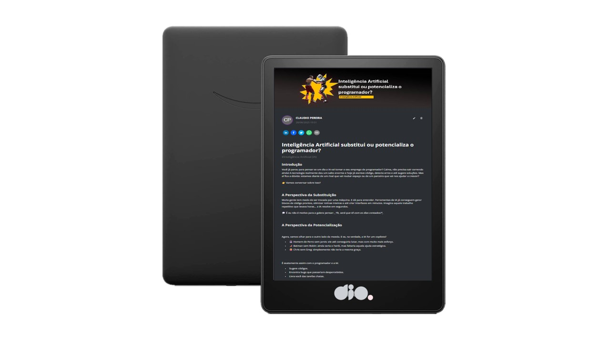

    

  
  

-------

  

## 🤖 Projeto: Inteligência Artificial substitui ou potencializa o programador?

Projeto com o objetivo de gerar um artigo técnico com um layout rico, leitura agradável e com foco em promover autoridade técnica na área de programação e Inteligência Artificial.

<a href="https://web.dio.me/articles/inteligencia-artificial-substitui-ou-potencializa-o-programador-3af8d3e14972">📕 Clique aqui para ler o artigo</a>

## 💻 Tecnologias utilizadas no projeto

- [ChatGPT](https://chat.openai.com/) – para criação do título e do conteúdo

- [Lexica.art](https://lexica.art/) – para seleção e geração de imagens ilustrativas
- [PowerPoint](https://www.microsoft.com/en/microsoft-365/powerpoint) – para formatação de banners e layouts do artigo

- [Photopea](https://www.photopea.com/) - para completar as ferramentas indisponiveis no microsoft 365 online.

## 📄 Prompts e ferramentas

**Ferramentas:** 
- ChatGPT

**Prompt 1 :** 

Definir assunto: 5 titulos sobre programador vs i.A;
- {tema} = Inteligência Artificial substitui ou potencializa o programador?

**Prompt 2 :**

**tema: “{{Título do Artigo}}”**

**Introdução**

Comece apresentando o {tema} com uma pergunta instigante.
Use tom leve e acessível, contextualizando o impacto do assunto {{tema}}.
Não entregue a resposta de cara, apenas desperte a curiosidade.

**desafios sobre o {tema}**

Mostre os medos ou riscos associados ao {{tema}}.
Liste 3 pontos concretos (pode ser com bullets/ícones):

- Ponto 1.

- Ponto 2.

- Ponto 3.

Inclua uma frase reflexiva ou provocativa (“Será que estamos com os dias contados?”).

**Perspectiva de um ponto sobre o {tema}**

Agora mostre o lado positivo: como o {tema} pode potencializar ou ajudar.
Use analogias divertidas (ex: heróis, duplas famosas).
Liste 3 benefícios práticos:

- Benefício 1.
- Benefício 2.
- Benefício 3.

Finalize destacando algo pertinente ao {tema}: 

**O que dizem os grandes nomes**

Traga frases curtas de especialistas ou fontes confiáveis que reforcem o ponto.
Formato sugerido:

**Nome (Cargo/Empresa)**
“Citação impactante sobre o {tema}.”
(Fonte: link ou mídia)

Use 3 a 4 referências.

**Conclusão**

Feche respondendo a questão central:
 O {tema} + {meu ponto de vista}.

Enfatize: um ponto chave do {tema}

Liste 3 pontos-chave que o leitor deve levar consigo.

**Hashtags**

3 a 5# que estejam atrelados ao texto e ao {tema} 

---

No Lexica, utilizamos o acervo público de imagens geradas por outras pessoas. Os termos de pesquisa usados foram:

- Inteligência Artificial

- Programadores

- Futuro da programação

## ✨Features

- Conteúdo gerado via ChatGPT

- Imagens selecionadas do acervo público via Lexica.art

- Layout diagramado em PowerPoint

## 📚 Materiais

- Prompts utilizados

- curso da Dio do "Felipe Aguiar".

## 🛠️ Instruções de execução

Utilize os prompts acima nas ferramentas sugeridas para gerar o material base.
Depois, faça a diagramação em ferramentas de edição de documentos como PowerPoint, LibreOffice ou InDesign.
.

## 👨‍💻 Autor

Cláudio Faustino
[GitHub](https://github.com/fclaudio051/)| [LinkedIn](www.linkedin.com/in/claudiofaustinodev) | [Instagram](https://www.instagram.com/fclaudio051/#)

⌨️ com 💜 por [Cláudio Faustino](https://github.com/fclaudio051/)